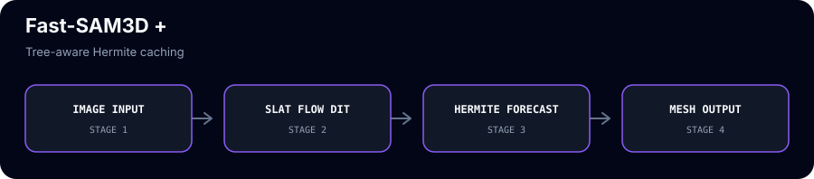
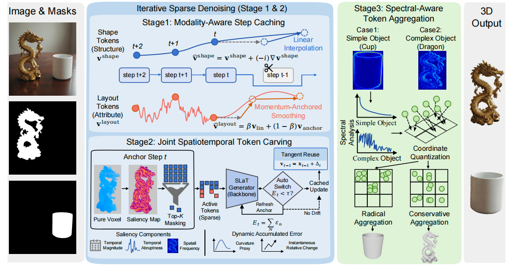
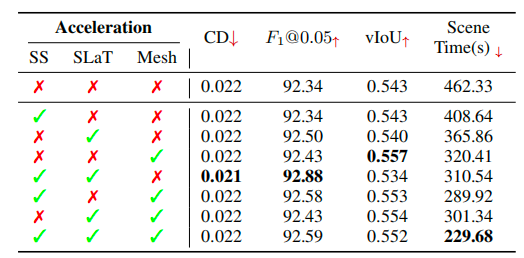

<div align="center">

# Fast-SAM3D **+** &nbsp;·&nbsp; HiCache

<p>
  <a href="https://github.com/Archerkattri/fastsam3d-plus/releases"></a>
  <a href="https://github.com/Archerkattri/fastsam3d-plus/releases"></a>
  <a href="LICENSE"></a>
</p>


**Image-to-3D, faster — Fast-SAM3D with a tree-aware HiCache cache on its slat-stage flow-matching.**

*Skip the dynamics network on most slat-stage solver steps and forecast the cached velocity
with a scaled-Hermite polynomial. Training-free, geometry-preserving, native (no monkey-patching).*

[](https://github.com/wlfeng0509/Fast-SAM3D)
&nbsp;[](https://github.com/facebookresearch/sam-3d-objects)
&nbsp;[](https://arxiv.org/abs/2602.05293)
&nbsp;[](https://arxiv.org/abs/2508.16984)
&nbsp;[](./LICENSE)
&nbsp;

</div>

## When to use this repo
## Architecture at a glance



The cache lives inside the SLaT flow loop and preserves the structured velocity tree while replacing selected dynamics evaluations with Hermite forecasts.





These repos are **complementary accelerators, not competing solutions** — each speeds up a *different*
base generator, and the `+` / `++` suffix is a **method choice**, not a rival product. Pick by
**(1) which base model you run**, then **(2) which forecast basis you want**:

| base generator | `+` = HiCache (Hermite) | `++` = HiCache++ (DMD) |
|---|---|---|
| Hunyuan3D-2.1 | `hunyuan2.1-plus` | `hunyuan2.1-plus-plus` |
| Hunyuan3D-2 mini | `hunyuan2-plus` | `hunyuan2-plus-plus` |
| SAM 3D Objects | `sam3d-plus` | `sam3d-plus-plus` |
| Fast-SAM3D | `fastsam3d-plus` | `fastsam3d-plus-plus` |
| TRELLIS (v1) | `faster-trellis` | `faster-trellis-plus-plus` |
| TRELLIS.2-4B (v2) | `hermit-trellis2` | `hermit-trellis2-plus-plus` |

- **`+` (HiCache / scaled-Hermite):** the *published* polynomial velocity-forecast basis — conservative, reproduces the HiCache paper. Use it to deploy the established method.
- **`++` (HiCache++ / DMD exponential):** our Dynamic-Mode-Decomposition basis — *the same near-lossless quality at wider skip intervals*, where the polynomial diverges. Use it when you push the cache interval for more speed.
- **standalone / model-agnostic:** [`hicache-plus-plus`](https://github.com/Archerkattri/hicache-plus-plus) — the forecaster itself, to add DMD caching to *your own* diffusion/flow model.
- **`fast-trellis2`** = the TaylorSeer baseline fork (the upstream "Fast" accel) — the v2 reference point, not a HiCache variant.

> **This repo:** `fastsam3d-plus` — **Fast-SAM3D × HiCache (Hermite)** — on the TaylorSeer-cached Fast-SAM3D pipeline.

---

## What it is

A fork of [**Fast-SAM3D**](https://github.com/wlfeng0509/Fast-SAM3D) (single-image → textured 3D
mesh, itself a TaylorSeer-style accelerated [SAM3D](https://github.com/facebookresearch/sam-3d-objects))
that adds **HiCache** — a feature cache — to the **slat-stage flow-matching sampler**.

SAM3D generates in two flow-matching stages; the second (**slat**) stage integrates an ODE
`dx/dt = v_θ(x, t)` with a Euler solver, where each `v_θ` call is an expensive DiT forward.
HiCache runs the network on a sparse schedule and, on every **skipped** step, *forecasts* the
(CFG-combined) velocity from cached anchors instead of calling `v_θ`. SAM3D's velocities are
`torch.utils._pytree` structures (not single tensors), so this fork's HiCache is **tree-aware**:
the Hermite/finite-difference coefficients are scalars shared across all leaves, and a forecast
is one `tree_map` per order. The companion **Adaptive-CFG** drops the unconditional pass once it
aligns with the conditional one. Wiring is **native** — the solver and CFG modules call the
helpers directly; there is no runtime patching.

## Method — scaled-Hermite velocity forecasting

HiCache ([arXiv:2508.16984](https://arxiv.org/abs/2508.16984)) caches the velocity at compute
steps and extrapolates it to skipped steps with a **dual-scaled physicist's Hermite polynomial**
`H̃ₙ(x) = σⁿ Hₙ(σx)`. From the cached anchors it forms finite-difference "derivatives" `Δ⁰…Δᵐ` of
the velocity tree and predicts the velocity `k` steps past the last compute step as a
Hermite-weighted sum of those derivatives. The Hermite basis tempers the high-order extrapolation
that makes a plain Taylor (monomial) cache diverge, so it stays lossless at a larger skip interval
than TaylorSeer — but, being a **polynomial**, it still drifts as the skip grows. The exponential
successor that pushes the lossless skip further lives in [`fastsam3d-plus-plus`](https://github.com/Archerkattri/fastsam3d-plus-plus).

## Enable it (real API)

The cache attaches to the slat-stage `FlowMatching` generator's Euler solver. The model methods are
chainable (they return the model):

```python
from argparse import Namespace
from pathlib import Path
import sys
from omegaconf import OmegaConf

# Run from this repository after installing Fast-SAM3D's inference dependencies.
repo = Path.cwd()
sys.path.insert(0, str(repo / "notebook"))
from inference import Inference
config = OmegaConf.load(repo / "checkpoints/hf/pipeline.yaml")
config.workspace_dir = str(repo / "checkpoints/hf")
config["ss_generator_config_path"] = "ss_generator_taylorseer.yaml"
config["slat_generator_config_path"] = "slat_generator_taylorseer.yaml"
args = Namespace(enable_taylor=True, enable_ss_faster=False, enable_slat_token=False,
                 enable_mesh_aggregation=False, enable_acceleration=False, enable_easy=False,
                 ss_faster_stride=3, ss_warmup=2, ss_order=1, ss_momentum_beta=0.5,
                 slat_thresh=0.5, slat_warmup=2, slat_token_ratio=0.15,
                 mesh_spectral_threshold_low=0.5, mesh_spectral_threshold_high=0.7)
inference = Inference(config, compile=False, args=args)
fm = inference._pipeline.models["slat_generator"]  # the SLaT FlowMatching generator

# HiCache: forecast the velocity on skipped slat steps with the scaled-Hermite polynomial.
fm.enable_hicache(
    interval=3,        # run the DiT 1 step in `interval`; forecast the other (interval-1)
    max_order=1,       # highest finite-difference order used in the Hermite forecast
    first_enhance=2,   # always run full for the first N steps (warm-up)
    end_enhance=None,  # always run full for the final steps (defaults to the last step)
    sigma=0.5,         # Hermite scale σ ∈ (0,1)
)
# Optional CFG-only acceleration on the same SLaT generator. The SS PointmapCFG path
# is not counted as supported by this baseline unless it exposes these methods.
fm.reverse_fn.enable_adaptive_guidance(gamma_bar=0.94, warmup=2, max_order=1)

# ... run the pipeline / sampler as usual ...

fm.disable_hicache()   # back to the dense (uncached) schedule
telemetry = fm.get_hicache_telemetry()  # actual full/forecast counts after a run
cfg_telemetry = fm.reverse_fn.get_adaptive_guidance_telemetry()
```

Under the hood `enable_hicache` stores the config on the Euler solver
(`ODESolver.enable_hicache`); on each step the solver calls `hicache_decide` and, when it returns
`"forecast"`, replaces the `dynamics_fn` (DiT) call with `hicache_forecast_tree` — see
[`accel.py`](sam3d_objects/model/backbone/generator/flow_matching/accel.py),
[`solver.py`](sam3d_objects/model/backbone/generator/flow_matching/solver.py), and
[`model.py`](sam3d_objects/model/backbone/generator/flow_matching/model.py).
Caching is supported only for the exact `Euler` solver and this SLaT generator; other solver
types remain dense and report `unsupported_solver` through telemetry. The SS stage's native
TaylorSeer/carving path is not changed by this switch.

## Results

This repository is a Hermite reference implementation, not a universal speed winner. The
versioned [`benchmarks/fastsam3d-plus.json`](benchmarks/fastsam3d-plus.json) card records the
available single-input historical result: F1@0.05 remained 1.000, while Hermite measured
0.922× the Taylor baseline speed in that run. Treat those values as configuration- and
input-specific; rerun the portable harness before making a timing claim. For the exponential
DMD variant, see [`fastsam3d-plus-plus`](https://github.com/Archerkattri/fastsam3d-plus-plus) and
the standalone library [`hicache-plus-plus`](https://github.com/Archerkattri/hicache-plus-plus).

> The Hermite ⇄ Taylor swap on the SS stage is a wash — that stage already runs a fixed
> TaylorSeer stride, so the basis change there doesn't move latency. HiCache's gain is on the
> **slat** stage, where it forecasts the skipped velocities.


### Sign-convention update (2026-06-10)

The vendored Hermite forecast evaluated the basis at `x = -k`; the corrected convention from
[hicache-plus-plus 1.2.0](https://github.com/Archerkattri/hicache-plus-plus) is `x = +k` (the
upstream TaylorSeer distance convention; `-k` flips every odd-order term, extrapolating
backwards). This fork now ships the corrected forecast in both Hermite sites
(`flow_matching/accel.py`, the slat-stage forecaster, and `forecast_basis.py`, the pluggable
SS-stage basis). The published numbers above were measured with the as-released code and
remain valid as-measured.

The checked-in single-input artifact is bound to its own commit, input, seed, threshold, and
timing scope in the manifest. It is not a multi-seed or current-commit release benchmark.
The corrected-vs-as-released table is in
[`sam3d-plus`](https://github.com/Archerkattri/sam3d-plus#sign-convention-update-2026-06-10)
(identical vendored port, same harness). Re-validation of the SS-stage Taylor-vs-Hermite wash
with the corrected basis is pending.

## Attribution

- **Fast-SAM3D** — © [wlfeng0509](https://github.com/wlfeng0509/Fast-SAM3D)
  ([arXiv:2602.05293](https://arxiv.org/abs/2602.05293)); built on
  [SAM3D](https://github.com/facebookresearch/sam-3d-objects) (© Meta). The upstream README is preserved
  in this fork's git history and its license/attribution is unchanged. The SAM 3D weights this fork runs
  on remain under the Meta [SAM License](./LICENSE) — research/responsible-use, publication-acknowledgement,
  and trade-control / ITAR / sanctions restrictions apply; it is **not** permissive or unconditionally
  commercial.
- **HiCache** — scaled-Hermite velocity forecasting, [arXiv:2508.16984](https://arxiv.org/abs/2508.16984).
  This fork is a clean tree-aware reimplementation on Fast-SAM3D's slat flow-matching.
- **Adaptive-CFG** — Adaptive Guidance, [arXiv:2312.12487](https://arxiv.org/abs/2312.12487).
- **HiCache++** (the exponential successor) — [`fastsam3d-plus-plus`](https://github.com/Archerkattri/fastsam3d-plus-plus) ·
  standalone [`hicache-plus-plus`](https://github.com/Archerkattri/hicache-plus-plus).

## Citation

If you use this fork, please cite the base model and the acceleration methods it builds on.

**Fast-SAM3D** (base model):

```bibtex
@misc{feng2026fastsam3d3dfyimagesfaster,
      title={Fast-SAM3D: 3Dfy Anything in Images but Faster}, 
      author={Weilun Feng and Mingqiang Wu and Zhiliang Chen and Chuanguang Yang and Haotong Qin and Yuqi Li and Xiaokun Liu and Guoxin Fan and Zhulin An and Libo Huang and Yulun Zhang and Michele Magno and Yongjun Xu},
      year={2026},
      eprint={2602.05293},
      archivePrefix={arXiv},
      primaryClass={cs.CV},
      url={https://arxiv.org/abs/2602.05293}, 
}
```

**HiCache** (scaled-Hermite velocity forecasting):

```bibtex
@misc{hicache2025,
      title={HiCache: Training-free Acceleration of Diffusion Models via Hermite Polynomial Feature Forecasting},
      eprint={2508.16984},
      archivePrefix={arXiv},
      year={2025}
}
```

**TaylorSeer** (the cache the base model accelerates with):

```bibtex
@misc{taylorseer2025,
      title={From Reusing to Forecasting: Accelerating Diffusion Models with TaylorSeers},
      eprint={2503.06923},
      archivePrefix={arXiv},
      year={2025}
}
```

**Adaptive Guidance**:

```bibtex
@misc{adaptiveguidance2023,
      title={Adaptive Guidance: Training-free Acceleration of Conditional Diffusion Models},
      eprint={2312.12487},
      archivePrefix={arXiv},
      year={2023}
}
```

## Weights & data

Model weights and demo/example assets are **not** committed to this repo — only the acceleration
architecture (code + integration). Download the base-model weights from the upstream project,
[wlfeng0509/Fast-SAM3D](https://github.com/wlfeng0509/Fast-SAM3D), per its instructions, and point the loader at them (see the code / upstream README). This
keeps the repository lightweight and avoids redistributing third-party weights.

---

## Family

Part of the **HiCache++ acceleration family**.

- **Family hub:** [`hicache-plus-plus`](https://github.com/Archerkattri/hicache-plus-plus) — the basis library behind this adapter.
- **Sibling:** [`fastsam3d-plus-plus`](https://github.com/Archerkattri/fastsam3d-plus-plus) — the same base model with the HiCache++ (Dynamic Mode Decomposition / Prony) exponential-forecast variant.

## Current release status

The current adapter includes shared HiCache++ cache identity, timing and
fallback accounting. Eight CPU contract tests pass. GPU model execution,
segmentation quality and end-to-end speed comparisons remain unmeasured.
